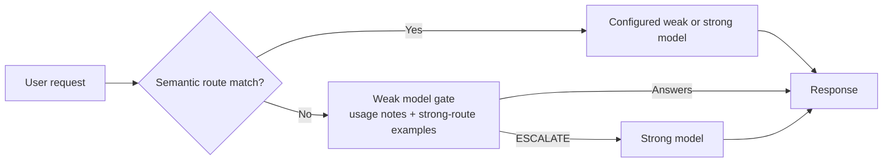

# route67

`route67` is a LLM router for OpenAI-compatible chat completions. It uses a
user-defined routing table for semantic request-to-model routing, then falls
back to a weak-model gate that either answers directly or explicitly escalates
to a strong model.

## How it works



## Install

route67 requires Python 3.10 or newer. Choose either the standard Python workflow
or the `uv` workflow.

### Using `python -m venv`

Create and activate a virtual environment:

```console
python -m venv .venv
```

```powershell
# Windows PowerShell
.\.venv\Scripts\Activate.ps1
```

```console
# macOS/Linux
source .venv/bin/activate
```

Then install route67 and its dependencies:

```console
python -m pip install --upgrade pip
python -m pip install -e .
```

To also install the test dependencies, use `python -m pip install -e ".[test]"`.

### Using `uv`

With [`uv`](https://docs.astral.sh/uv/) installed, create the environment and
install the project from the lockfile:

```console
uv sync
```

Run commands inside the environment with `uv run`, for example
`uv run python example.py`. To include test dependencies, use
`uv sync --extra test`.

## Get started

Set an OpenAI API key in your environment:

```powershell
# Windows PowerShell
$env:OPENAI_API_KEY = "your-api-key"
```

```console
# macOS/Linux
export OPENAI_API_KEY="your-api-key"
```

The repository includes a minimal [example.py](example.py):

```python
from llm_router import Controller, ModelSpec, RouterConfig, RoutingTableEntry

config = RouterConfig(
    routing_table=[
        RoutingTableEntry(
            "Prove this theorem",
            "strong_model",
            notes="Requires a rigorous multi-step proof.",
        ),
        RoutingTableEntry("Rewrite this paragraph", "weak_model"),
    ],
    weak_model=ModelSpec(
        "gpt-5-mini",
        usage_notes="Avoid difficult multi-step proofs.",
    ),
    strong_model=ModelSpec(
        "gpt-5",
        usage_notes="Use for rigorous proofs and difficult reasoning.",
    ),
    embedding_cache_path=".cache/routes",
    log_path=".cache/routing.jsonl",
)

client = Controller(config)
response = client.chat.completions.create(
    messages=[{"role": "user", "content": "Prove that sqrt(2) is irrational."}]
)
print(response.choices[0].message.content)
```

Run it with the activated standard virtual environment:

```console
python example.py
```

Or with `uv`:

```console
uv run python example.py
```

### OpenAI-compatible providers

route67 can use any provider exposed through an OpenAI-compatible client. Create
the provider's client normally and inject it into the controller. Model names in
the routing configuration are passed to that provider unchanged.

If you want to use another OpenAI-compatible provider, swap in that provider's
client. For example, with OpenRouter:

```python
"""Minimal route67 example using the default OpenAI client."""

import os

from openai import OpenAI
from llm_router import Controller, ModelSpec, RouterConfig, RoutingTableEntry

openrouter = OpenAI(
    base_url="https://openrouter.ai/api/v1",
    api_key=os.environ["OPENROUTER_API_KEY"],
)

config = RouterConfig(
    routing_table=[
        RoutingTableEntry(
            "Answer questions about a country",
            "weak_model",
        ),
        RoutingTableEntry(
            "How to derive the Boolean Satisfiability, a NP problem",
            "strong_model",
            notes="Requires careful multi-step reasoning.",
        ),
    ],
    weak_model=ModelSpec(
        "liquid/lfm-2-24b-a2b",
        usage_notes="Best for straightforward factual and writing questions.",
    ),
    strong_model=ModelSpec(
        "deepseek/deepseek-v4-flash",
        usage_notes="Use for difficult reasoning, mathematics, and verification.",
    ),
    similarity_threshold=0.11 #obtained from running bechmark_router.py to find best threshold
)

client = Controller(config, openai_client=openrouter)
response = client.chat.completions.create(
    messages=[
        {
            "role": "user",
            "content": "How to solve the NP problem of Traveling salesman",
        }
    ],
    extra_body={"reasoning": {"enabled": True}},
)

print(f"Response model name: {response.model}")
print(response.choices[0].message.content)
```

Provider-specific request options such as `extra_body` and `extra_headers` are
forwarded unchanged. Provider-specific response fields, including
`reasoning_details`, are also preserved. To continue a provider's reasoning,
pass its assistant message fields back unmodified in the next request.

Routing table entries target only `"weak_model"` or `"strong_model"`. Provider
model names live in `ModelSpec`, so switching models or providers does not
require rewriting the routing table.

`ModelSpec.usage_notes` are added to the weak model's escalation system prompt.
The prompt also includes up to five routing-table entries targeting
`"strong_model"` as examples of requests that should be escalated. Add concise
`notes` to those entries when the reason for escalation is useful context.

Your first request will download the `minishlab/potion-base-8M` embedding model
from HuggingFace. The model is lazy-loaded, so constructing a controller with
an empty routing table does not download it.

## Benchmarking

The repository includes a synthetic routing benchmark in
`router_eval_dataset.jsonl` and a separate seed routing table in
`benchmarks/router_seed_table.json`. The seed routes are intentionally broader
than the eval queries so the benchmark does not simply memorize the dataset.

Run the benchmark after installing the package:

```console
python benchmarks/benchmark_router.py
```

To explore threshold tradeoffs:

```console
python benchmarks/benchmark_router.py --threshold-sweep
```

To search a lower threshold range and choose the best threshold by strong-route
F1:

```console
python benchmarks/benchmark_router.py --threshold-sweep --threshold-sweep-start 0.05 --threshold-sweep-end 0.50 --threshold-sweep-step 0.01 --optimize-metric strong_f1
```

This benchmark is separate from the unit test suite. It is meant to evaluate
semantic routing quality and threshold behavior, not to act as a deterministic
correctness test for every change.
